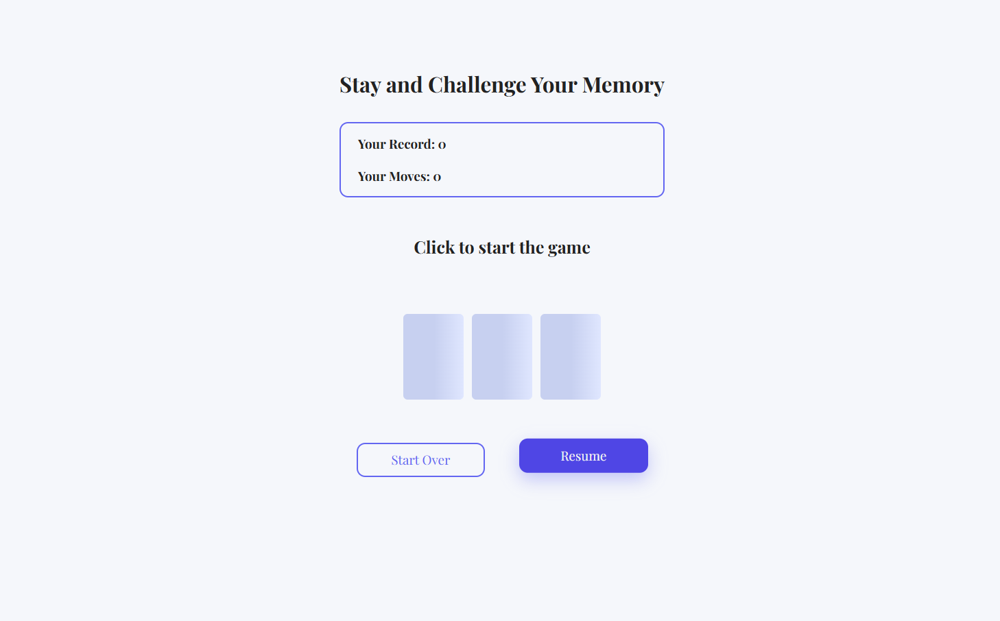

# Memory-Game v 2.0.0


A responsive and interactive browser-based Memory Card Game built with Vanilla JavaScript, HTML, and CSS.  
This project was developed as part of my frontend learning journey, focusing on clean structure, modular logic, and real-world deployment.


## 🔗 About The Project

This project is a classic memory matching card game where players flip cards to find matching pairs.  
It was built as a learning project to practice:

- DOM manipulation
- Modular JavaScript
- Game logic implementation
- LocalStorage usage
- Code refactoring & version improvement
- Deployment using GitHub Pages


## 🔗 Live Demo
https://zohreh-pdr.github.io/Memory-Game


##  Installation / Usage

Clone the repository:
```bash
git clone https://github.com/zohreh-pdr/Memory-Game.git
cd Memory-Game
npm install
npm start
```


## Features

- Interactive card flipping
- Move counter
- Game resume using LocalStorage
- Best score persistence
- Restart functionality
- Responsive layout

##  Technologies Used

- HTML5
- CSS3
- Vanilla JavaScript (ES6+)
- Parcel (for bundling & development server)


## 🧠 Key Learning Outcomes

- Improved understanding of state management in vanilla JavaScript
- Learned how to refactor tightly coupled code into modular structure
- Practiced using LocalStorage for data persistence
- Gained experience deploying a project using GitHub Pages


##  Project Structure

This repository contains:

- **Version 1** → Initial implementation
- **Version 2** → Refactored and improved version
- `dist/` → Production-ready build files used for GitHub Pages deployment


## 🔄 Version Comparison

🥇 Version 1
Initial version of the project.

Known issues:
- Game logic tightly coupled with DOM manipulation
- No modular structure


🥈 Version 2
Refactored and improved version.

Improvements:
- Cleaner modular structure
- Improved game logic
- More maintainable code
- Better user experience


##  Future Features 

- Add difficulty levels
- Add sound effects
- Add multiplayer mode
- Add timer
- Improve UI/UX design


##  Screenshots




##  License

This project is licensed under the **MIT License** — feel free to use, modify, and learn from it.


##  Contributing
Contributions are welcome! Please open an issue or submit a pull request.


##  👩‍💻 Author

**Zohre Padarloo**  
Junior Frontend Developer
Focused on writing clean, maintainable, and scalable code.


